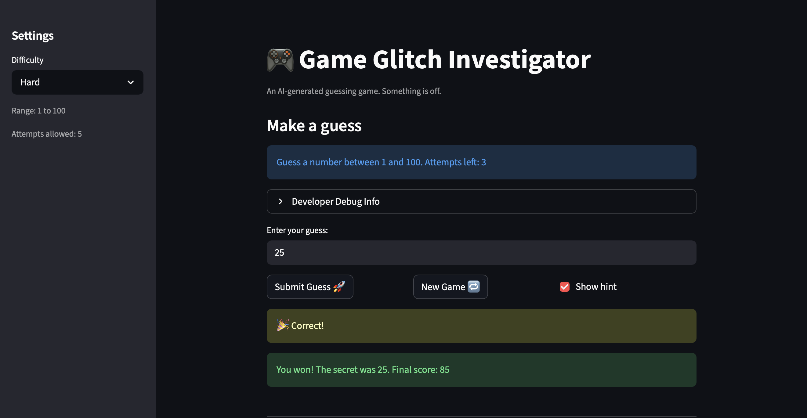

# 🎮 Game Glitch Investigator: The Impossible Guesser

## 🚨 The Situation

You asked an AI to build a simple "Number Guessing Game" using Streamlit.
It wrote the code, ran away, and now the game is unplayable. 

- You can't win.
- The hints lie to you.
- The secret number seems to have commitment issues.

## 🛠️ Setup

1. Install dependencies: `pip install -r requirements.txt`
2. Run the broken app: `python -m streamlit run app.py`

## 🕵️‍♂️ Your Mission

1. **Play the game.** Open the "Developer Debug Info" tab in the app to see the secret number. Try to win.
2. **Find the State Bug.** Why does the secret number change every time you click "Submit"? Ask ChatGPT: *"How do I keep a variable from resetting in Streamlit when I click a button?"*
3. **Fix the Logic.** The hints ("Higher/Lower") are wrong. Fix them.
4. **Refactor & Test.** - Move the logic into `logic_utils.py`.
   - Run `pytest` in your terminal.
   - Keep fixing until all tests pass!

## 📝 Document Your Experience

- Describe the game's purpose.
[ This is a guessing game. Given 3 difficulties, you are prompted to guess a number within the given range. While you are putting your guesses, you can choose to get hints on going higher or lower to get close to the secret number. ] 
- Detail which bugs you found.
[ The secret number kept changing every 2 attempts, the game did not reset after win/lose condition, normal difficulty was easier than easy difficulty. ] 
- Explain what fixes you applied.
[ Made the secret number stay the same throughout the guessing round, made the reset button start a new game, gave the easy settings more attempts than normal, fixed scoring to only deduct with more guesses. ] 

## 📸 Demo

- [] 

## 🚀 Stretch Features

- [ ] [If you choose to complete Challenge 4, insert a screenshot of your Enhanced Game UI here]
